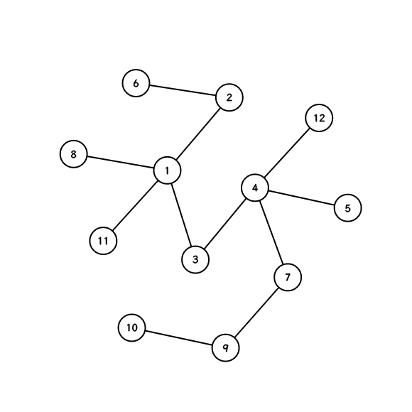
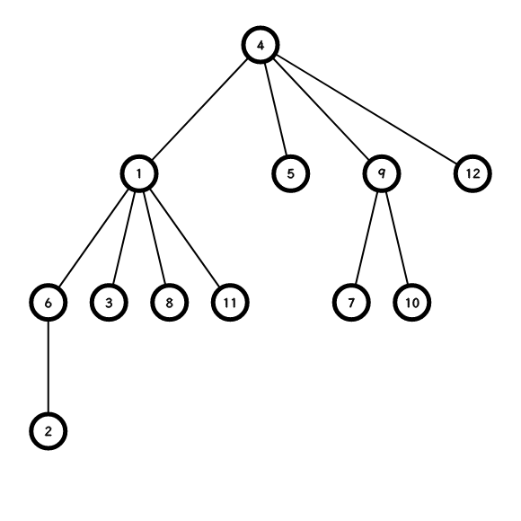
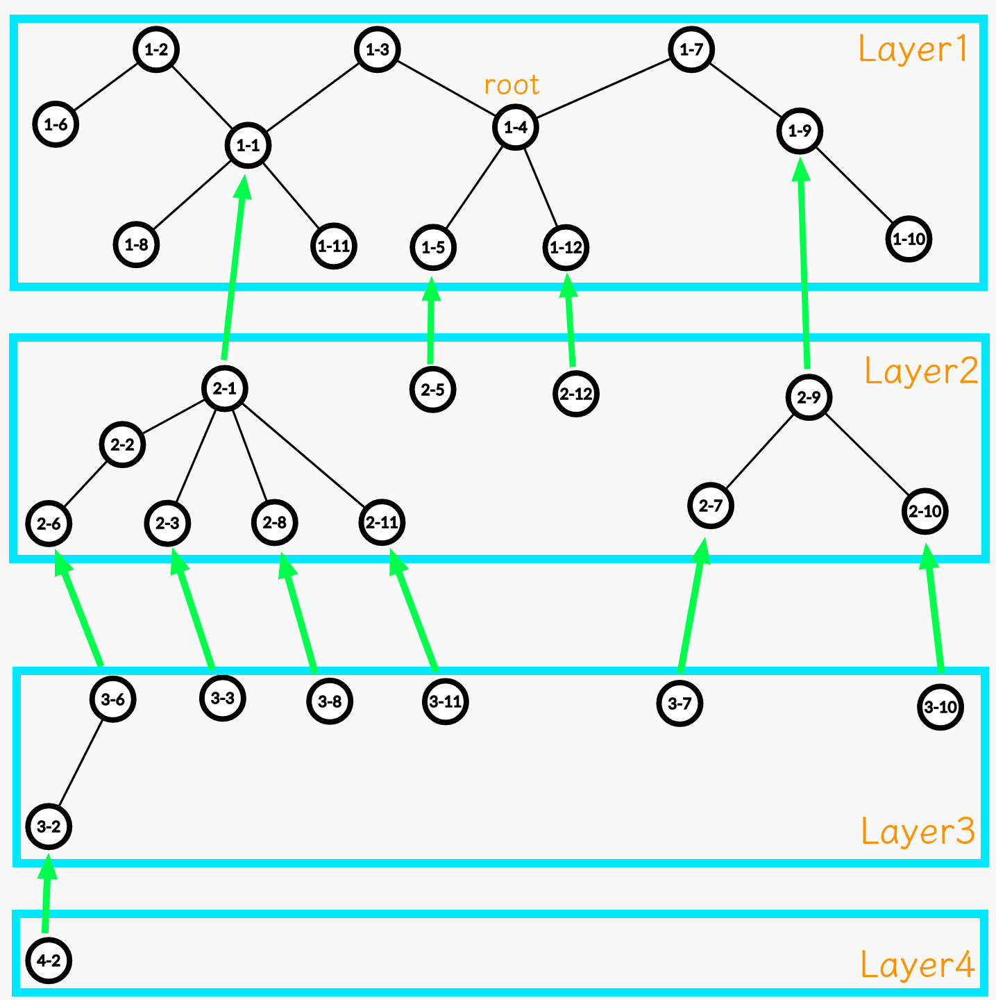

# 点分治与点分树

> ~~淀粉质和淀粉树~~

点分治主要处理的东西：

非容斥解法：子树集合的答案计算+子树集合与整树集合的合并

容斥解法：集合的答案计算

> `v!=fa&&!del[v]`

# 问题集

## [【模板】点分治1](https://www.luogu.com.cn/problem/P3806)

### 题意

给定一棵有 $n$ 个点的树，询问树上距离为 $k$ 的点对是否存在。

### 思路

模板题，用一个数组记录对应的距离是否存在，dfs的时候判断一下即可。

实现上的细节，把询问离线统一处理可以避免复杂度乘上点分治的常数。另外注意 `1e8>1e7` 可能导致的数组越界。

复杂度 $\mathcal{O}(nm\log n)$。

### 实现

> [评测记录](https://www.luogu.com.cn/record/123140216)

```cpp
bool mark[M];
void dfs(int u,int fa,int d,int type) {
    if(type==0) {
        for(int i=1;i<=m;i++) {
            if(k[i]-d>=0&&mark[k[i]-d])
                ans[i]=1;
        }
    }
    if(type==1) mark[d]=1;
    if(type==2) mark[d]=0;
    for(auto [v,w]:adj[u]) {
        if(v!=fa&&!del[v]) {
            dfs(v, u, d+w, type);
        }
    }
}

void solve(int _u,int tot) {
    centroid[0]=centroid[1]=0;
    get_centroid(_u, -1, tot);
    int u=centroid[0];
    get_centroid(u, -1, tot);
    del[u]=1;

    for(auto [v,w]:adj[u]) {
        if(!del[v]) {
            dfs(v, u, w, 0);
            dfs(v, u, w, 1);
        }
    }
    for(int i=1;i<=m;i++) if(mark[k[i]]) ans[i]=1;
    
    for(auto [v,w]:adj[u]) {
        if(!del[v]) {
            dfs(v, u, w, 2);
        }
    }
    
    for(auto [v,_]:adj[u]) if(!del[v]) solve(v, sz[v]);
}
```

## [Tree](https://www.luogu.com.cn/problem/P4178)

### 题意

给定一棵 $n$ 个节点的树，每条边有边权，求出树上两点距离小于等于 $k$ 的点对数量。

### 思路

和上一题类似，使用树状数组维护相应距离的数量即可。

复杂度 $\mathcal{O}(n \log^2 n)$。

### 实现

> [评测记录](https://www.luogu.com.cn/record/123150760)

```cpp
Fenwick<> tr(K);
void dfs(int u,int fa,int d,int type) {
    if(d>=K) return;
    if(type==0) ans+=tr.query(k-d);
    else if(type==1) tr.modify(d, 1);
    else tr.reset(d);
    for(auto [v,w]:adj[u]) {
        if(v!=fa&&!del[v]) {
            dfs(v, u, d+w, type);
        }
    }
}

void solve(int _u,int tot) {
    centroid[0]=centroid[1]=0;
    get_centroid(_u, -1, tot);
    int u=centroid[0];
    get_centroid(u, -1, tot);
    del[u]=1;

    tr.modify(0, 1);
    for(auto [v,w]:adj[u]) {
        if(!del[v]) {
            dfs(v, u, w, 0);
            dfs(v, u, w, 1);
        }
    }
    tr.reset(0);
    for(auto [v,w]:adj[u]) if(!del[v]) dfs(v, u, w, 2);
    for(auto [v,w]:adj[u]) if(!del[v]) solve(v, sz[v]);
}
```

## [智乃的树分治（模板）](https://ac.nowcoder.com/acm/contest/32254/A)

### 题意

给定一个大小为 $n$ 的无根树和一个距离常数 $d$，计算每个点周围到它的距离不超过 $d$ 的点的数量。

### 思路

根据题意，一条长度不超过 $d$ 的路径仅会对两个端点造成 $+1$ 的贡献。那么这实际上就是树上路径统计问题。

对于当前分治根节点 $u$，统计以 $u$ 为起点的链，按照链长计数，$cnt_i$ 表示长度为 $i$ 的链数量。那么对于一个点 $v$，首先加上 $cnt_{d-dis(u,v)}$ 然后再减去子树内的贡献，子树内的贡献直接复用函数计算即可。

也可以前后缀各做一遍，这样就不需要容斥。

复杂度 $\mathcal{O}(n \log n)$。

### 实现

[评测记录](https://ac.nowcoder.com/acm/contest/view-submission?submissionId=63581350)

```cpp
int cnt[N],ans[N],d;
void get_cnt(int u,int fa,int dep) {
    if(dep>d) return;
    cnt[dep]++;
    for(int v:adj[u]) {
        if(v!=fa&&!del[v]) {
            get_cnt(v,u,dep+1);
        }
    }
}

void get_ans(int u,int fa,int dep,int sign,int lim) {
    if(dep>d) return;
    for(int v:adj[u]) {
        if(v!=fa&&!del[v]) {
            get_ans(v,u,dep+1,sign,lim);
        }
    }
    ans[u]+=sign*cnt[min(d-dep,lim)];
}

void solve(int _u,int tot) {
    centroid[0]=centroid[1]=0;
    get_centroid(_u, -1, tot);
    int u=centroid[0];
    get_centroid(u, -1, tot);
    del[u]=1;

    get_cnt(u, 0, 0);
    for(int i=1;i<=min(sz[u],d);i++) cnt[i]+=cnt[i-1];
    get_ans(u, 0, 0, 1, sz[u]);
    for(int i=0;i<=min(sz[u],d);i++) cnt[i]=0;

    for(int v:adj[u]) {
        if(!del[v]) {
            get_cnt(v, u, 1);
            for(int i=1;i<=min(sz[v],d);i++) cnt[i]+=cnt[i-1];
            get_ans(v, u, 1, -1, sz[v]);
            for(int i=0;i<=min(sz[v],d);i++) cnt[i]=0;
        }
    }

    for(int v:adj[u]) if(!del[v]) solve(v, sz[v]);
}
```

## [树上游戏](https://www.luogu.com.cn/problem/P2664)

### 题意

树上每个点有一种颜色，统计从每个点出发的路径的权值和，权值定义为路径的颜色数量。

### 思路

设当前的分治重心为 $rt$。

维护 $cnt_i$ 表示含有颜色 $i$ 的路径数量。那么 $\sum cnt_i$ 就是总共的权值和，记这个值为 $cnt_{tot}$。同时维护一下总共的路径数量，记为 $path$。

接下来考虑如何计算答案。类似区间数颜色，用一个桶保存 $rt$ 到 $u$ 路径上的颜色。设 $u$ 的答案为 $res_u$。

假设当前从 $u$ dfs 到了 $v$ 时新增了颜色 $c_v$，分类讨论：

- 若 $c_v$ 在桶中出现过，那么 $res_v=res_u$
- 否则 $res_v=res_u+path-cnt_{c_v}$，即有 $path-cnt_{c_v}$ 条路径新增了一种颜色。

考虑如何更新 $cnt$，同样分类讨论：

- 若 $c_v$ 在桶中出现过，$path+1$
- 否则 $cnt_{c_v}+sz_u,path+1$。

复杂度 $\mathcal{O}(n \log n)$。

### 实现

> [评测记录](https://www.luogu.com.cn/record/123220206)

```cpp
LL ans[N];
int c[N],cnt[N],cur[N],cnt_tot,path;
void dfs(int u,int fa,int type,LL res) {
    if(type==0) {
        if(!cur[c[u]]) {
            cnt[c[u]]+=sz[u];
            cnt_tot+=sz[u];
        }
        path++;
    }
    else if(type==1) {
        if(!cur[c[u]]) res+=path-cnt[c[u]];
        ans[u]+=res;
    }
    else if(type==2) {
        if(!cur[c[u]]) {
            cnt[c[u]]-=sz[u];
            cnt_tot-=sz[u];
        }
        path--;
    }
    cur[c[u]]++;
    for(int v:adj[u]) {
        if(v!=fa&&!del[v]) {
            dfs(v, u, type, res);
        }
    }
    cur[c[u]]--;
}

void solve(int _u,int tot) {
    centroid[0]=centroid[1]=0;
    get_centroid(_u, -1, tot);
    int u=centroid[0];
    get_centroid(u, -1, tot);
    del[u]=1;

    dfs(u, 0, 0, 0);
    ans[u]+=cnt_tot;
    for(int v:adj[u]) {
        if(!del[v]) {
            cur[c[u]]++;
            dfs(v, u, 2, 0);
            cur[c[u]]--;
            cnt[c[u]]-=sz[v];
            cnt_tot-=sz[v];

            cur[c[u]]++;
            dfs(v, u, 1, cnt_tot);
            cur[c[u]]--;

            cur[c[u]]++;
            dfs(v, u, 0, 0);
            cur[c[u]]--;
            cnt[c[u]]+=sz[v];
            cnt_tot+=sz[v];
        }
    }
    dfs(u, 0, 2, 0);
    for(int v:adj[u]) if(!del[v]) solve(v, sz[v]);
}
```

## [CF EDU45G GCD Counting](https://codeforces.com/contest/990/problem/G)

### 题意

给定一个大小为 $n$ 的带点权的树，统计所有路径的 $\gcd$。

### 思路1 并查集+容斥

考虑从数据薄弱处下手，发现 $a_i$ 最多只有 $2 \times 10^5$，那么我们可以尝试反着做，枚举最终的答案 $i$，每次只处理含有 $i$ 因子的点，大小为 $sz$ 的连通块答案就是 $\binom{sz}{2}$，用并查集维护连通块，然后再对答案做一遍容斥即可。

### 思路2 点分治

~~不会~~

## [Longest Path](https://ac.nowcoder.com/acm/contest/32254/D)

### 题意

给定一个大小为 $n$ 的树，每条边有个颜色 $c_i$。设 $u \rightarrow v$ 经过的边的颜色为 $c_1,c_2 \dots c_k$，定义 $d(u,v)=\sum_{i=2}^{k}(c_{i}-c_{i-1})^2$，定义 $f_u=\max_v{d(u,v)}$。

对于每个点 $u$，求 $f_u$ 。

### 思路

~~不会~~

## [2023 西安邀请赛 C.Delete the Tree](https://qoj.ac/contest/1291/problem/6745)

### 题意

给定一个大小为 $n$ 的树，每次选一些点，要求这些点两两不相邻，然后删去这些点，然后每个点将周围的点两两相连。具体可以看题目中的图。

$n \le 500$，要求步数不超过 $10$。

### 思路

不太懂，感觉点分治的过程很好契合题目要求的性质，~~然后直接交就过了，感觉非常神~~。

> [评测记录](https://qoj.ac/submission/153300)

## [智乃的点分树（模板）](https://ac.nowcoder.com/acm/contest/32254/B)

点分治仅能处理单次的全局查询，如果需要处理多次参数不同的查询，或者带修改，就无法直接用点分治解决。如果我们使用特定的数据结构将分治过程的信息保存，就能实现点分治的持久化，即“动态点分治”，而保存分治重心信息的数据结构便是点分树。

原树 | 点分树
:-: | :-:
 | 

如果把每个分治重心能够遍历到的树结构整理出来，便能得到一个分层树。

分层树|
:-:


分层树直观地展示了在跑点分治时，在每个分治重心实际处理的树结构。

## [[HNOI2015] 开店](https://www.luogu.com.cn/problem/P3241)

和上题差不多，都是从统计从某点出发的路径集合中有满足性质的有多少条/权值和。

## [【模板】点分树 | 震波](https://www.luogu.com.cn/problem/P6329)

