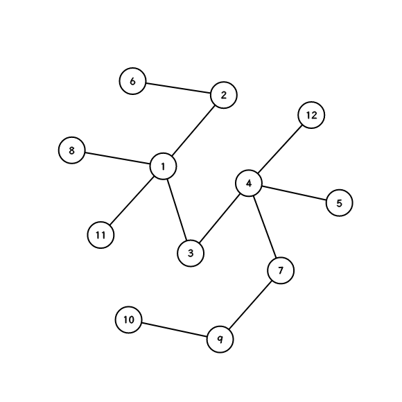

# $\text{Graph and Tree}$ 图论与树论

- [树论](#树论)
  - [最近公共祖先](#最近公共祖先)
    - [重链剖分](#重链剖分)
    - [树上倍增](#树上倍增)
  - [树链剖分](#树链剖分)
    - [重链剖分](#重链剖分-1)
    - [长链剖分](#长链剖分)
  - [DSU on Tree](#dsu-on-tree)
  - [树重心](#树重心)
  - [树分治](#树分治)
    - [点分治](#点分治)
    - [动态点分治](#动态点分治)
  - [虚树](#虚树)
  - [树哈希](#树哈希)
- [图论与流](#图论与流)
  - [强连通分量](#强连通分量)
  - [最大流](#最大流)
  - [费用流](#费用流)
  - [上下界可行流](#上下界可行流)
    - [无源汇上下界可行流](#无源汇上下界可行流)
    - [有源汇上下界可行流](#有源汇上下界可行流)
    - [有源汇上下界最大流](#有源汇上下界最大流)
    - [有源汇上下界最小流](#有源汇上下界最小流)
  - [最小割模型](#最小割模型)
    - [最大权闭合图](#最大权闭合图)
      - [将最大权闭合图转化为流网络](#将最大权闭合图转化为流网络)
      - [计算最大权值和](#计算最大权值和)
      - [方案](#方案)
    - [最小点权覆盖集](#最小点权覆盖集)
      - [建图\&求解](#建图求解)
      - [方案](#方案-1)
    - [最大点权独立集](#最大点权独立集)
      - [建图\&求解](#建图求解-1)

<br/>
<br/>
<br/>
<br/>
<br/>
<br/>
<br/>
<br/>
<br/>

# 树论

## 最近公共祖先

### 重链剖分

基于树链剖分，预处理复杂度 $\mathcal{O}(n)$，查询复杂度 $\mathcal{O}(\log n)$，常数较小。

```cpp
namespace hpd {
    constexpr int N=1e5+10;
    vector<int> adj[N];
    int dep[N],sz[N],top[N],p[N],hch[N];

    void dfs1(int u,int fa,int d) {
        dep[u]=d,p[u]=fa,sz[u]=1;
        for(int v:adj[u]) {
            if(v==fa) continue;
            dfs1(v,u,d+1);
            sz[u]+=sz[v];
            if(sz[hch[u]]<sz[v]) hch[u]=v;
        }
    }

    void dfs2(int u,int t) {
        top[u]=t;
        if(!hch[u]) return;
        dfs2(hch[u],t);
        for(int v:adj[u])
            if(v!=p[u]&&v!=hch[u]) dfs2(v,v);
    }

    int lca(int x,int y) {
        while(top[x]!=top[y]) {
            if(dep[top[x]]<dep[top[y]]) swap(x,y);
            x=p[top[x]];
        }
        if(dep[x]<dep[y]) swap(x,y);
        return y;
    }

    void init() {
        dfs1(1,-1,1); dfs2(1,1);
    }

    void clear(int n) {
        fill(hch, hch+n+1, 0);
        for(int i=0;i<=n;i++) adj[i].clear();
    }
}
```

### 树上倍增

基于树上倍增，预处理复杂度 $\mathcal{O}(n \log n)$，查询复杂度 $\mathcal{O}(\log n)$。

倍增常数相比树剖更大，但是维护路径信息更方便。

```cpp
constexpr int N=1e5+10,M=__lg(N);
int fa[N][M+1],dep[N];

void lca_init(int u,int p) {
    dep[u]=dep[p]+1;
    for(int v:adj[u]) {
        if(v==p) continue;
        fa[v][0]=u;
        for(int i=1;i<=M;i++)
            fa[v][i]=fa[fa[v][i-1]][i-1];
        lca_init(v,u);
    }
}

int lca(int u,int v) {
    if(dep[u]<dep[v]) swap(u,v);
    for(int k=M;~k;k--)
        if(dep[fa[u][k]]>=dep[v])
            u=fa[u][k];
    if(u==v) return u;
    for(int k=M;~k;k--)
        if(fa[u][k]!=fa[v][k])
            u=fa[u][k],v=fa[v][k];
    return fa[u][0];
}
```

## 树链剖分

### 重链剖分

重链剖分能将树上路径转为 $\mathcal{O}(\log n)$ 个连续区间，从而将树上问题转化为区间问题。预处理时间复杂度 $\mathcal{O}(n)$，单次路径剖分时间复杂度 $\mathcal{O}(\log n)$。

关于实现上的易错点：把 `id[u]` 写成 `u`，务必注意。

```cpp
// ! don't confuse dfn id with node id
namespace hpd {
    using PII=pair<int,int>;
    constexpr int N=1e5+10;
    int id[N],w[N],ori[N],cnt;
    int dep[N],sz[N],top[N],p[N],hch[N];
    vector<int> adj[N];

    void dfs1(int u,int fa,int d) {
        dep[u]=d,p[u]=fa,sz[u]=1;
        for(int v:adj[u]) {
            if(v==fa) continue;
            dfs1(v,u,d+1);
            sz[u]+=sz[v];
            if(sz[hch[u]]<sz[v]) hch[u]=v;
        }
    }

    void dfs2(int u,int t) {
        id[u]=++cnt,ori[id[u]]=u,top[u]=t;
        if(!hch[u]) return;
        dfs2(hch[u],t);
        for(int v:adj[u])
            if(v!=p[u]&&v!=hch[u]) dfs2(v,v);
    }

    int lca(int x,int y) {
        while(top[x]!=top[y]) {
            if(dep[top[x]]<dep[top[y]]) swap(x,y);
            x=p[top[x]];
        }
        if(dep[x]<dep[y]) swap(x,y);
        return y;
    }

    vector<PII> decompose(int x,int y) {
        vector<PII> res;
        while(top[x]!=top[y]) {
            if(dep[top[x]]<dep[top[y]]) swap(x,y);
            res.emplace_back(id[top[x]],id[x]);
            x=p[top[x]];
        }
        if(dep[x]<dep[y]) swap(x,y);
        res.emplace_back(id[y],id[x]);
        return res;
    }

    PII decompose(int x) {
        return { id[x],id[x]+sz[x]-1 };
    }

    void init() {
        dfs1(1,-1,1); dfs2(1,1);
    }

    void clear(int n) {
        cnt=0;
        fill(hch, hch+n+1, 0);
        for(int i=0;i<=n;i++) adj[i].clear();
    }
}
```

### 长链剖分

长链剖分将重儿子定义为子树深度最深的儿子，轻重链切换次数最多为 $\mathcal{O}(\sqrt{n})$。

长链剖很适合维护深度相关的信息，也可以加速与深度相关的dp。

使用长链剖实现的dsu on tree，复杂度 $\mathcal{O}(n)$。

```cpp
namespace lpd {
    constexpr int N=1e5+10;
    int id[N],ed[N],ori[N],len[N],hch[N],top[N],dfn;
    vector<int> adj[N];

    void dfs1(int u,int fa) {
        for(int v:adj[u]) {
            if(v!=fa) {
                dfs1(v,u);
                if(len[hch[u]]<len[v]) hch[u]=v;
            }
        }
        len[u]=len[hch[u]]+1;
    }

    void dfs2(int u,int fa,int t) {
        top[u]=t;
        ori[id[u]=++dfn]=u;
        ed[u]=id[u]+len[u]-1;
        if(hch[u]) dfs2(hch[u],u,t);
        for(int v:adj[u]) if(v!=fa&&v!=hch[u]) dfs2(v,u,v);
    }

    void init() { dfs1(1,0),dfs2(1,0,1); }
    
    void solve(int u,int fa) {
        if(hch[u]) solve(hch[u],u);
        // todo 合并u点信息
        for(int v:adj[u]) {
            if(v!=fa&&v!=hch[u]) {
                solve(v,u);
                // todo 合并轻儿子链信息
                for(int i=1,j=0;j<len[v];i++,j++) {
                    // info(u,i) <- info(v,j)
                }
            }
        }
    }
}
```

## DSU on Tree

dsu on tree 是一种树上的离线算法，可以用来解决形如“多个询问，每次询问一个子树中满足xx性质的节点有多少个”这种问题。

dsu on tree 本质是一种启发式算法，因此被叫做“树上启发式合并”，其过程看起来暴力无比但又可以证明其复杂度是对的。

以树上数颜色为例，假设当前考虑的点为 $u$，算法的流程为：

1. 对于 $u$ 所有的轻儿子，调用 `solve(v,keep=0)`。
2. 对于 $u$ 的重儿子，调用 `solve(v,keep=1)`。
3. 对于 $u$ 所有的轻儿子，利用 $dfn$ 序遍历子树节点，加入其对 $cnt$ 的影响。
4. 将 $u$ 点的颜色加入 $cnt$ 得到 $ans[u]$。
5. 若 `solve(u)` 传入的 `keep=0`，利用 $dfn$ 序暴力删除整棵 $u$ 子树对 $cnt$ 的影响。

每个点都不会被遍历超过 $\mathcal{O}(\log n)$ 次，总复杂度为 $\mathcal{O}(n\log n)$。

```cpp
namespace dsu {
    constexpr int N=1e5+10; // ***
    int id[N],ed[N],ori[N],sz[N],hch[N],idx;
    vector<int> adj[N];

    void init(int u,int fa) {
        sz[u]=1;
        id[u]=++idx;
        ori[id[u]]=u;
        for(int v:adj[u]) {
            if(v!=fa) {
                init(v,u);
                if(sz[v]>sz[hch[u]]) hch[u]=v;
                sz[u]+=sz[v];
            }
        }
        ed[u]=idx;
    }

    void solve(int u,int fa,bool keep) {
        auto add=[](int id) {
            int x=ori[id];
            
        };

        auto del=[](int id) {
            int x=ori[id];
            
        };
        
        for(int v:adj[u]) if(v!=fa&&v!=hch[u]) solve(v,u,0);
        if(hch[u]) solve(hch[u],u,1);
        for(int v:adj[u]) 
            if(v!=fa&&v!=hch[u]) 
                for(int i=id[v];i<=ed[v];i++) add(i);
        add(id[u]);
        
        // TODO update ans

        if(!keep) for(int i=id[u];i<=ed[u];i++) del(i);
    }

    void clear(int n=N-1) {
        idx=0;
        fill(hch,hch+n+1,0);
        for(int i=0;i<=n;i++) adj[i].clear();
    }
}
```

## 树重心

一棵无根树的重心是子树大小最大值最小的节点。

时间复杂度 $\mathcal{O}(n)$。

```cpp
int sz[N],centroid[2];
void get_centroid(int u,int fa,int tot) {
    int maxx=0;
    sz[u]=1;
    for(int v:adj[u]) {
        if(v!=fa) {
            get_centroid(v,u,tot);
            sz[u]+=sz[v];
            maxx=max(maxx,sz[v]);
        }
    }
    maxx=max(maxx,tot-sz[u]);
    if(maxx<=tot/2) centroid[centroid[0]!=0]=u;
}
```

## 树分治

### 点分治

点分治适合处理大规模的树上路径信息问题。

设当前分治重心为 $u$，则所有树上的所有路径可以分类为：

- 经过 $u$ 的路径
  - 一端为 $u$ 的路径
  - 两端都不为 $u$ 的路径
- 不经过 $u$ 的路径（递归处理）

每次选择新的根后，都要重新计算一遍子树大小。点分治通常会使用容斥来去除非法路径信息。

每次递归子树大小至少减半，基础复杂度 $\mathcal{O}(n \log n)$。

```cpp
namespace cd {
    constexpr int N=1e5+10;
    int sz[N],centroid[2];
    vector<int> adj[N];
    bool del[N];

    void get_centroid(int u,int fa,int tot) {
        int maxx=0;
        sz[u]=1;
        for(int v:adj[u]) {
            if(v!=fa&&!del[v]) {
                get_centroid(v,u,tot);
                sz[u]+=sz[v];
                maxx=max(maxx,sz[v]);
            }
        }
        maxx=max(maxx,tot-sz[u]);
        if(maxx<=tot/2) centroid[centroid[0]!=0]=u;
    }

    void solve(int _u,int tot) {
        centroid[0]=centroid[1]=0;
        get_centroid(_u, -1, tot);
        int u=centroid[0];
        get_centroid(u, -1, tot);
        del[u]=1;

        for(int v:adj[u]) {
            if(!del[v]) {
                // TODO
            }
        }

        for(int v:adj[u]) if(!del[v]) solve(v, sz[v]);
    }

    void clear(int n) {
        fill(del,del+1+n,0);
        for(int i=1;i<=n;i++) adj[i].clear();
    }
}
```

### 动态点分治

借助点分树，我们可以实现支持修改和查询的动态点分治。

相比静态点分治额外维护的信息：

- `p[u]` $u$ 在点分树上的父节点。
- `lyr[u]` $u$ 作为分治重心所属的层数。
- `belong[lay][u]` $u$ 在 $lay$ 层所属的分治重心下的子树。

对于当前分治重心，同时维护整棵树和每颗子树的信息来方便修改和查询。

建树基础复杂度 $\mathcal{O}(n \log n)$，修改/查询基础复杂度 $\mathcal{O}(\log n)$。空间复杂度 $\mathcal{O}(n \log n)$。

注意，爬点分树时信息（如深度）是非单调的。

```cpp
namespace cd {
    constexpr int N=1e5+10,L=__lg(N)+2;
    int sz[N],centroid[2],belong[L][N],lyr[N],p[N];
    vector<int> adj[N];
    bool del[N];

    void get_centroid(int u,int fa,int tot) {
        int maxx=0;
        sz[u]=1;
        for(int v:adj[u]) {
            if(v!=fa&&!del[v]) {
                get_centroid(v,u,tot);
                sz[u]+=sz[v];
                maxx=max(maxx,sz[v]);
            }
        }
        maxx=max(maxx,tot-sz[u]);
        if(maxx<=tot/2) centroid[centroid[0]!=0]=u;
    }

    // todo 统计从分治重心子节点开始的信息
    void dfs_subtr(int lay,int rt,int u,int fa) {
        belong[lay][u]=rt;
        for(int v:adj[u]) {
            if(v!=fa&&!del[v]) {
                dfs_subtr(lay, rt, v, u);
            }
        }
    }

    // todo 统计从分治重心开始的信息
    void dfs_rt(int lay,int rt,int u,int fa) {

        for(int v:adj[u]) {
            if(v!=fa&&!del[v]) {
                dfs_rt(lay, rt, v, u);
            }
        }
    }

    int build(int lay,int _u,int tot) {
        centroid[0]=centroid[1]=0;
        get_centroid(_u, -1, tot);
        int u=centroid[0];
        get_centroid(u, -1, tot);
        lyr[u]=lay;
        del[u]=1;

        for(int v:adj[u]) if(!del[v]) dfs_subtr(lay, v, v, u);

        // todo 统计从u开始的信息

        for(int v:adj[u]) if(!del[v]) p[build(lay+1, v, sz[v])]=u;
        return u;
    }

    void modify(int u,int s) {
        int lay=lyr[u];
        // todo 修改u信息

        if(u!=s) {
            int v=belong[lay][s];
            // todo 修改s所属的子树v信息
        }
        if(p[u]) modify(p[u], s);
    }

    LL query(int u,int s) {
        LL res=0;
        int lay=lyr[u];
        // todo 合并u信息到答案

        if(u!=s) {
            int v=belong[lay][s];
            // todo 容斥减去s所属的子树v信息
        }
        if(p[u]) res+=query(p[u], s);
        return res;
    }

    void clear(int n) {
        fill(del,del+1+n,0);
        for(int i=0;i<=n;i++) adj[i].clear();
    }
}
```

**调试**

```
12
1 2
1 3
1 8
1 11
2 6
3 4
4 5
4 7
4 12
7 9
9 10
```

原树 | 点分树
:-: | :-:
 | 

如果把每个分治重心能够遍历到的树结构整理出来，便能得到一个分层树。

分层树 |
:-: |
 |

分层树直观地展示了在跑点分治时，在每个分治重心实际处理的树结构。

## 虚树

能在 $\mathcal{O}(k \log n)$ 时间内提取树上的 $k$ 个关键点建成一棵新树,并且新树的点数不超过 $2k$。

```cpp
namespace vt {
    constexpr int N=1e5+10,M=__lg(N);
    vector<int> vt[N],adj[N];
    int stk[N],top,id[N],idx;
    int fa[N][M+1],dep[N];
    bool key[N];
    
    void lca_init(int u,int p) {
        dep[u]=dep[p]+1;
        for(int v:adj[u]) {
            if(v==p) continue;
            fa[v][0]=u;
            for(int i=1;i<=M;i++)
                fa[v][i]=fa[fa[v][i-1]][i-1];
            lca_init(v,u);
        }
    }
    
    int lca(int u,int v) {
        if(dep[u]<dep[v]) swap(u,v);
        for(int k=M;~k;k--)
            if(dep[fa[u][k]]>=dep[v])
                u=fa[u][k];
        if(u==v) return u;
        for(int k=M;~k;k--)
            if(fa[u][k]!=fa[v][k])
                u=fa[u][k],v=fa[v][k];
        return fa[u][0];
    }

    void relabel(int u,int fa) {
        id[u]=++idx;
        for(int v:adj[u]) if(v!=fa) relabel(v, u);
    }

    void build(vector<int> &vec) {
        sort(vec.begin(),vec.end(),[](int x,int y) {
            return id[x]<id[y];
        });

        // TODO clearup dirt memory
        auto clear=[&](int u) {
            vt[u].clear();
            key[u]=0;
        };

        auto add=[&](int u,int v) {
            vt[u].emplace_back(v);
        };
        
        clear(1);
        stk[top=0]=1;
        for(int u:vec) {
            if(u==1) continue;
            int p=lca(u,stk[top]);
            if(p!=stk[top]) {
                while(id[p]<id[stk[top-1]])
                    add(stk[top-1],stk[top]),top--;
                if(id[p]!=id[stk[top-1]])
                    clear(p),add(p,stk[top]),stk[top]=p;
                else add(p,stk[top--]);
            }
            clear(u);
            stk[++top]=u;
            key[u]=1;
        }
        for(int i=0;i<top;i++) add(stk[i],stk[i+1]);
    }

    void init() {
        lca_init(1, 0);
        relabel(1, 0);
    }

    void clear(int n) {
        idx=0;
        for(int i=0;i<=n;i++) adj[i].clear();
    }
}
```

## 树哈希

基于`xor shift`的树哈希。

```cpp
struct Hasher {
    ULL rnd;

    ULL operator()(ULL x) {
        x^=rnd;
        x^=x<<13;
        x^=x>>7;
        x^=x<<13;
        x^=rnd;
        return x;
    }

    Hasher() {
        mt19937 gen(random_device{}());
        rnd=gen();
    }
} f;
```

邓老师版本

```cpp
struct Hasher {
    LL rnd1,rnd2;

    LL operator()(LL x) {
        auto h=[&](LL x) {
            return x * x * x * rnd1 + rnd2;
        };
        LL res = h(x & ((1LL << 31) - 1)) + h(x >> 31);
        return res;
    }

    Hasher() {
        mt19937 gen(random_device{}());
        rnd1=gen(),rnd2=gen();
    }
} f;
```

# 图论与流

## 强连通分量

使用 $\text{Tarjan}$ 算法求强连通分量，时间复杂度 $\mathcal{O}(n)$。

按照 `scc_cnt` 倒序遍历便是拓扑序。

```cpp
namespace scc {
    int dfn[N],low[N],id[N],sz[N],scc_cnt,tsp;
    vector<int> stk;
    bool ins[N];

    void tarjan(int u) {
        dfn[u]=low[u]=++tsp;
        stk.push_back(u),ins[u]=1;
        for(int v:adj[u]) {
            if(!dfn[v]) {
                tarjan(v);
                low[u]=min(low[u],low[v]);
            }
            else if(ins[v]) low[u]=min(low[u],dfn[v]);
        }
        if(dfn[u]==low[u]) {
            scc_cnt++;
            int x;
            do {
                x=stk.back();
                stk.pop_back();
                ins[x]=0;
                id[x]=scc_cnt;
                sz[scc_cnt]++;
            } while(x!=u);
        }
    }

    void init(int n) {
        if(tsp) {
            scc_cnt=tsp=0;
            for(int i=1;i<=n;i++) dfn[i]=sz[i]=0;
        }
        for(int i=1;i<=n;i++) if(!dfn[i]) tarjan(i);
    }
} using scc::id,scc::sz,scc::scc_cnt;
```

## 最大流

$\text{Dinic}$ 算法，复杂度 $\mathcal{O}(n^2m)$。在单位网络运作的复杂度为 $\mathcal{O}(m \sqrt n)$。

```cpp
template<typename cap,int vertex,int edge> struct Flow {
    constexpr static int N=vertex,M=edge;
    constexpr static cap INF=cap(1)<<(8*sizeof(cap)-2);
    int e[M],ne[M],idx;
    int h[N],q[N],arc[N],d[N];
    cap f[M];
    int S,T=N-1;

    void add_edge(int a,int b,cap c) {
        e[idx]=b,f[idx]=c,ne[idx]=h[a],h[a]=idx++;
        e[idx]=a,f[idx]=0,ne[idx]=h[b],h[b]=idx++;
    }

    cap dfs(int u,cap lim) {
        if(u==T) return lim;
        cap flow=0;
        for(int i=arc[u];~i&&flow<lim;i=ne[i]){
            int v=e[i];
            arc[u]=i;
            if(f[i]&&d[v]==d[u]+1){
                cap t=dfs(v,min(f[i],lim-flow));
                if(!t) d[v]=-1;
                f[i]-=t,f[i^1]+=t,flow+=t;
            }
        }
        return flow;
    }

    bool bfs() {
        memset(d,-1,sizeof d);
        q[0]=S,arc[S]=h[S],d[S]=0;
        int hh=0,tt=1;
        while(hh<tt) {
            int ver=q[hh++];
            for(int i=h[ver];~i;i=ne[i]) {
                int t=e[i];
                if(f[i]&&d[t]==-1) {
                    d[t]=d[ver]+1;
                    arc[t]=h[t];
                    if(t==T) return 1;
                    q[tt++]=t;
                }
            }
        }
        return 0;
    }

    cap maxflow() {
        cap F=0,flow=0;
        while(bfs()) while(flow=dfs(S,INF)) F+=flow;
        return F;
    }

    void init() {
        idx=0;
        memset(h, -1, sizeof h);
    }

    Flow() { init(); }
};
```

## 费用流

$\text{EK}$ 算法，复杂度 $\mathcal{O}(n^2m)$。

```cpp
template<typename cap,typename cost,int vertex,int edge> struct Flow {
    constexpr static int N=vertex,M=edge,INF=cap(1)<<(8*sizeof(cap)-2);
    int S=0,T=N-1,idx;
    int ne[M],e[M];
    int h[N],q[N],pre[N];
    cap f[M],mf[N];
    cost d[N],w[M];
    bool inq[N];

    void add_edge(int a,int b,cap c,cost d) {
        e[idx]=b,f[idx]=c,w[idx]=d,ne[idx]=h[a],h[a]=idx++;
        e[idx]=a,f[idx]=0,w[idx]=-d,ne[idx]=h[b],h[b]=idx++;
    }

    bool spfa() {
        memset(d,0x3f,sizeof d);
        memset(mf,0,sizeof mf);
        int hh=0,tt=1;
        q[0]=S,d[S]=0,mf[S]=INF;
        while(hh!=tt) {
            int u=q[hh++];
            if(hh==N) hh=0;
            inq[u]=0;

            for(int i=h[u];~i;i=ne[i]) {
                int v=e[i];
                if(f[i]&&d[v]>d[u]+w[i]) {
                    d[v]=d[u]+w[i];
                    pre[v]=i;
                    mf[v]=min(mf[u],f[i]);
                    if(!inq[v]){
                        q[tt++]=v;
                        if(tt==N) tt=0;
                        inq[v]=1;
                    }
                }
            }
        }
        return mf[T]>0;
    }

    pair<cap,cost> maxflow() {
        cap flow=0; cost val=0;
        while(spfa()) {
            flow+=mf[T],val+=mf[T]*d[T];
            for(int i=T;i!=S;i=e[pre[i]^1]) {
                f[pre[i]]-=mf[T];
                f[pre[i]^1]+=mf[T];
            }
        }
        return {flow,val};
    }

    void init() {
        idx=0;
        memset(h, -1, sizeof h);
    }

    Flow() { init(); }
};
```

## 上下界可行流

### 无源汇上下界可行流

1. 建立虚拟的源汇点$S',T'$，对于任意一点 $u\in E$ ，当$x=\sum c_下(v,u)-\sum c_下(u,v)>0$ 时，从源点向$u$连一条容量为$x$的边，反之从$u$向汇点连接一条容量为$-x$的边
2. 原网络中的每条边的容量设为为$c_上(u,v)-c_下(u,v)$

对新网络$G'$跑最大流算法即得解。

### 有源汇上下界可行流

$S,T$可以看作两个特殊点，它们不满足流守恒。我们可以简单的建一条$T\rightarrow S$，容量下界为0,上界为$\infty$的边使它们能够流守恒，这样就转化为了一个无源汇的上下界可行流问题。

### 有源汇上下界最大流

由于在做完一遍无源汇上下界可行流时，和 $S',T'$ 相连的边都已经满流，所以$S\rightarrow T$ 的增广路上一定不包含$S',T'$，所以我们不必拆除$S',T'$和与其相连的边，因为它们不影响结果，从$S$到$T$求一遍最大流再加上原本的可行流流量即可。注意求最大流的时候要拆掉新加的 $T\rightarrow S$ 的边，否则答案可能会偏大。

### 有源汇上下界最小流

和最大流类似，从$S$到$T$的流量表示剩下还可以追加的流量，在求最小流的时候，我们反向搜索从$T$到$S$的最大流，表示可以从可行流中退回的部分流量。注意同样要删去额外加上的$T\rightarrow S$的边，否则会退回无穷大的流量。

## 最小割模型

### 最大权闭合图

闭合图指一个对于有向图 $G=(V,E)$ 的点集 $V'$，使得 $V'$ 中的所有点的出边指向 $V'$ 中的点。最大权闭合图即权值和最大的闭合图。

#### 将最大权闭合图转化为流网络

对于原图 $G$ 中的边，将这些边的容量设为 $\infty$；建立一个虚拟源点 $S$，向每个权值 $w_i$ 为正的边连一条容量为 $w_i$ 的边；建立一虚拟汇点 $T$，每个权值 $w_i$ 为负的点向$T$连一条容量为 $|w_i|$ 的边。

#### 计算最大权值和

最大权闭合图的点权之和=所有正权值之和-最小割的容量

$$
w(V')=\sum_{v\in V^+}{w_v}-c[S,T]
$$

建图之后使用最大流算法求解

#### 方案

求出最小割后 $S$ 集合点即为选择的点。

### 最小点权覆盖集

对于一个带点权的图 $G=(E,V)$，一个点覆盖集是指在集合 $V$ 中选择一个子集 $V'$，使得集合 $E$ 中的每一条边的两个端点至少有一个在 $V'$ 中。最小点权覆盖集即点权和最小的点覆盖集。

最小点权覆盖集是一个$npc$问题，网络流对于该问题的有效解法只对二分图有效。

最小点权覆盖集和二分图的简单割一一对应。

#### 建图&求解

如果想要将问题转化为此模型，需要题目给定一个二分图或者想办法建出一个二分图。

对于原图的边，边的容量设为 $\infty$ ，以保证割为简单割，再建立虚拟源点 $S$ 和虚拟汇点 $T$ ，源汇点和原图中的点建容量等于点权的边。

根据最小点权覆盖集的点权和等于最小割的容量，在流网络上跑最大流算法即得解。

#### 方案

最小割中割边的两端点 $s,t$ ， 因为是简单割，$s,t$ 必定存在一个源点或汇点，若 $s=S$  则覆盖集选择的点为 $t$ ，若 $t=T$ 则选择的是 $s$ 。通过 $dfs$ 找出割边再判断是 $s/t$ 即可。

### 最大点权独立集

对于一个带点权的图 $G=(E,V)$ ，点独立集是指在集合 $V$ 中选择一个子集 $V'$，使得$V'$ 中的点两两没有一条边相连。最大点权独立集即点权和最大的点独立集。

最大点独立集和最小点权覆盖集是一个对偶问题，可以使用反证法证明点覆盖集的补集为点独立集。点独立集和点覆盖集的点权和为所有点权和$sum$，所以最大点权独立集的点权和等于$sum-$最小点权覆盖集的点权和。

#### 建图&求解

同样的，最大点权独立集也是一个$npc$问题，建出二分图跑最小点权覆盖集再求差即可。